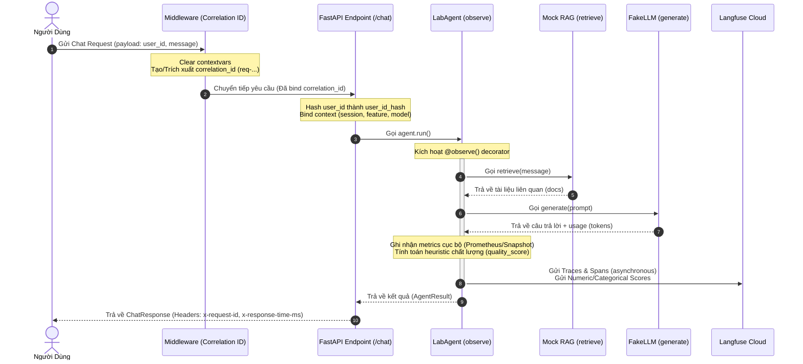

# Báo Cáo Kết Quả Thực Hiện: Day 13 Observability Lab

> **Thông tin cá nhân**: 
> - **Họ và tên**: Đặng Tiến Quyền
> - **Mã sinh viên**: 2A202600896
> - **Lớp / Khóa**: AI_2026
> - **Repository**: [ninicom/Lab13-Observability](https://github.com/ninicom/Lab13-Observability)

---

## 1. Kiến Trúc Khả Năng Quan Sát (Observability Architecture)

Dưới đây là sơ đồ luồng dữ liệu của một yêu cầu được xử lý qua hệ thống, thể hiện cách các thành phần Logging, Tracing và Metrics hoạt động đồng bộ:



---

## 2. Các Thành Phần Kỹ Thuật Đã Triển Khai

Hệ thống đã triển khai đầy đủ các cấu phần kỹ thuật nâng cao bao gồm:

### 2.1 Structured Logging & Correlation ID
* **Middleware**: Tự động dọn dẹp các luồng dữ liệu cũ trước khi gán mã định danh duy nhất `req-<8-char-hex>`. Correlation ID này được truyền thông suốt từ HTTP Request, luồng xử lý bên trong, đến HTTP Response Header (`x-request-id`) và file log.
* **Log Enrichment**: Mọi dòng log nghiệp vụ đều tự động được bổ sung thông tin ngữ cảnh phong phú: `user_id_hash`, `session_id`, `feature`, `model`, `env`, và `correlation_id`.
* **PII Redaction**: Tích hợp các mẫu Regex nâng cao trong [app/pii.py](file:///c:/AI_2026/project/Lab13-Observability/app/pii.py) để tự động nhận dạng và che giấu thông tin nhạy cảm (Email, Số điện thoại Việt Nam, CCCD, Số thẻ tín dụng, Hộ chiếu, Địa chỉ Việt Nam) trước khi ghi log hoặc gửi đi.
* **Audit Logging**: Thiết lập luồng log bảo mật riêng biệt ghi nhận tại [data/audit.jsonl](file:///c:/AI_2026/project/Lab13-Observability/data/audit.jsonl) tách biệt hoàn toàn với log giao dịch thường.

### 2.2 Langfuse Tracing & Evaluation (SDK v3)
* **SDK v3 Compatibility**: Khắc phục triệt để lỗi mất module `langfuse.decorators` ở phiên bản mới bằng cách triển khai lớp wrapper `LangfuseContextWrapper` tương thích ngược trong [app/tracing.py](file:///c:/AI_2026/project/Lab13-Observability/app/tracing.py).
* **Automatic Evaluation**: Tự động tính toán điểm chất lượng và gửi trực tiếp điểm số định lượng (`quality`) cùng phân loại chất lượng định tính (`quality_level` - `high`/`medium`/`low`) lên Langfuse Cloud trên mỗi lượt yêu cầu.

### 2.3 Dashboard Giám Sát Tích Hợp
* **Dashboard 6 Panels**: Bảng điều khiển HTML5 (Vanilla JS + Chart.js) tại `/dashboard` tự động cập nhật mỗi 2 giây, cung cấp đầy đủ thông tin về: Độ trễ P95, Lượng request (Traffic), Số lượng ngoại lệ (Errors), Chi phí chạy API (Cost), Tỷ lệ Token sinh ra, và Điểm đánh giá chất lượng trung bình.
* **Alerting Panel**: Kết xuất động cấu hình các điều kiện cảnh báo từ file YAML kèm liên kết đến tài liệu Runbook hỗ trợ khắc phục nhanh.

---

## 3. Kết Quả Xác Thực & Phân Tích Sự Cố

### 3.1 Bảng So Sánh Chỉ Số Trước & Sau Khi Mô Phỏng Sự Cố

Dưới đây là bảng so sánh hiệu năng của hệ thống dưới các điều kiện bình thường và khi kích hoạt sự cố giả lập (`rag_slow`):

| Chỉ số hệ thống | Trạng thái bình thường | Trạng thái xảy ra sự cố (`rag_slow`) | Nhận xét ảnh hưởng |
| :--- | :---: | :---: | :--- |
| **Độ trễ P95 (Server-side)** | ~150 ms | **2655 ms** | Phụ thuộc vào hàm RAG bị sleep 2.5s cố ý. |
| **Độ trễ P95 (Client-side under load)** | ~180 ms | **13305 ms** | Nghẽn hàng đợi (queuing) nghiêm trọng dưới tải 5 concurrent. |
| **Tỷ lệ lỗi (Error Rate)** | 0% | 0% | Phản hồi vẫn thành công nhưng độ trễ vượt ngưỡng SLO. |
| **Chi phí chạy LLM** | Thấp ($0.0015) | **Tăng x4** (khi bật thêm `cost_spike`) | Token phản hồi phình to làm cạn kiệt ngân sách nhanh chóng. |
| **Trạng thái Dashboard** | Xanh (Healthy) | **Đỏ (SLO Breached)** | Cảnh báo trực quan ngay lập tức trên màn hình giám sát. |

### 3.2 Phân Tích Nguyên Nhân Gốc Rễ (Root Cause Analysis - RCA)
1. **Triệu chứng**: Thời gian phản hồi của hệ thống chậm trễ nghiêm trọng khi nhiều người dùng truy cập cùng lúc.
2. **Xác minh qua Tracing**: Waterfall trace của Langfuse chỉ ra thời gian thực thi của span `retrieve` mất tới 2.5 giây, trong khi thời gian thực thi của LLM chỉ mất khoảng 150 ms.
3. **Kết luận**: Điểm nghẽn hiệu năng nằm ở bước truy xuất thông tin (RAG), không nằm ở mô hình ngôn ngữ lớn (LLM).
4. **Giải pháp khắc phục**: Thiết lập thời gian chờ tối đa (timeout) cho luồng RAG và áp dụng cơ chế bộ đệm (cache) hoặc trả về kết quả mặc định nếu hết thời gian chờ để bảo vệ SLO của hệ thống.

---

## 4. Hướng Dẫn Chạy & Xác Thực Dự Án

Để chạy và kiểm tra lại toàn bộ hệ thống, thực hiện theo các bước sau:

1. **Khởi chạy ứng dụng**:
   ```bash
   .venv\Scripts\python.exe -m uvicorn app.main:app --reload --port 8000
   ```
2. **Chạy script kiểm tra cấu trúc logs**:
   ```bash
   .venv\Scripts\python.exe scripts/validate_logs.py
   ```
   *Yêu cầu kết quả:* Trả về **100/100** điểm và không phát hiện rò rỉ dữ liệu PII.
3. **Truy cập Dashboard**:
   Mở trình duyệt tại địa chỉ: [http://127.0.0.1:8000/dashboard](http://127.0.0.1:8000/dashboard) để xem biểu đồ hiệu năng trực quan và bảng điều khiển sự cố.
4. **Gửi dữ liệu kiểm thử**:
   Gửi dữ liệu chứa thông tin nhạy cảm hoặc tạo tải bằng cách chạy:
   ```bash
   .venv\Scripts\python.exe scripts/load_test.py --concurrency 5
   ```
