# Kế hoạch Thực hiện Dự án: Day 13 Observability Lab

Tài liệu này phác thảo chi tiết kế hoạch thực hiện Lab Giám sát, Ghi nhật ký (Logging) và Khả năng quan sát (Observability) trong vòng 4 giờ. 

Hệ thống kế hoạch đã được tách riêng chi tiết theo từng người để thuận tiện cho việc phân vai, bàn giao và quản lý công việc:

---

## 🔗 Kế Hoạch Chi Tiết Theo Từng Thành Viên (Tách Riêng)

Nhấp vào các liên kết bên dưới để xem kế hoạch chi tiết của từng vai trò:

*   👤 **Member A: Logging & PII**
    *   *Nhiệm vụ:* Thiết lập JSON Log, Correlation ID Middleware & Trình lọc PII.
    *   *Xem chi tiết:* [member_a_logging_pii.md](file:///c:/AI_2026/project/Lab13-Observability/plan/member_a_logging_pii.md)
*   👤 **Member B: Tracing & Enrichment**
    *   *Nhiệm vụ:* Tích hợp Langfuse Tracing, bổ sung các thẻ Tags và Enrich Log Context.
    *   *Xem chi tiết:* [member_b_tracing_enrichment.md](file:///c:/AI_2026/project/Lab13-Observability/plan/member_b_tracing_enrichment.md)
*   👤 **Member C: SLO & Alerts**
    *   *Nhiệm vụ:* Định nghĩa SLOs, cấu hình Alert rules và viết tài liệu Runbook xử lý sự cố.
    *   *Xem chi tiết:* [member_c_slo_alerts.md](file:///c:/AI_2026/project/Lab13-Observability/plan/member_c_slo_alerts.md)
*   👤 **Member D: Load Test & Incidents**
    *   *Nhiệm vụ:* Chạy tải hệ thống (Load testing), giả lập lỗi (Incident Injection).
    *   *Xem chi tiết:* [member_d_load_test_incidents.md](file:///c:/AI_2026/project/Lab13-Observability/plan/member_d_load_test_incidents.md)
*   👤 **Member E: Dashboard & Evidence**
    *   *Nhiệm vụ:* Dựng Dashboard 6 panels từ `/metrics`, thu thập toàn bộ ảnh chụp minh chứng.
    *   *Xem chi tiết:* [member_e_dashboard_evidence.md](file:///c:/AI_2026/project/Lab13-Observability/plan/member_e_dashboard_evidence.md)
*   👤 **Member F: Blueprint & Demo**
    *   *Nhiệm vụ:* Tổng hợp báo cáo Blueprint cuối cùng, phối hợp kịch bản demo live.
    *   *Xem chi tiết:* [member_f_blueprint_demo.md](file:///c:/AI_2026/project/Lab13-Observability/plan/member_f_blueprint_demo.md)

*(Lưu ý: Nếu nhóm chỉ có 5 người, vai trò Member F sẽ được gộp vào Member E hoặc điều phối chung bởi Member D).*

---

## 📅 Các Phase Thực Hiện Theo Trục Thời Gian (Timeline)

```mermaid
gantt
    title Lộ trình 4 giờ Lab Observability
    dateFormat  HH:mm
    axisFormat %H:%M
    section Phase 1
    Khởi tạo & Setup Môi trường :active, p1, 00:00, 30m
    section Phase 2
    Phát triển Core (Logging, PII, Tracing) : p2, after p1, 90m
    section Phase 3
    Load Test, Incidents & Dashboard : p3, after p2, 45m
    section Phase 4
    Giả lập & Phân tích Sự cố : p4, after p3, 45m
    section Phase 5
    Thu thập Minh chứng & Viết Báo cáo : p5, after p4, 30m
```

### Phase 1: Setup & Khởi chạy Hệ thống (Thời gian: 0h00 - 0h30)
*   **Mục tiêu:** Toàn bộ thành viên setup thành công môi trường local và chạy được app FastAPI.
*   **Hành động:** Clone repo, cài đặt `pip install -r requirements.txt`, copy `.env` và chạy `uvicorn app.main:app --reload`.

### Phase 2: Triển khai Kỹ thuật Lõi (Thời gian: 0h30 - 2h00)
*   **Mục tiêu:** Hoàn thành code Core để vượt qua các bài kiểm tra tự động của log schema.
*   **Hành động:** Member A sửa đổi middleware/pii/logging; Member B enrich log và cấu hình Langfuse. Chạy `python scripts/validate_logs.py` để đạt 100/100 điểm logs.

### Phase 3: Load Test, Incident Injection & Dashboard (Thời gian: 2h00 - 2h45)
*   **Mục tiêu:** Tạo tải giả lập đồng thời và dựng dashboard quan sát.
*   **Hành động:** Member D chạy `load_test.py --concurrency 5` và kích hoạt lỗi. Member E thiết lập dashboard 6 panels hiển thị SLOs, Latency, Errors, Cost, Tokens, Quality.

### Phase 4: Giả lập Sự cố & Phân tích Nguyên nhân (Thời gian: 2h45 - 3h30)
*   **Mục tiêu:** Ứng dụng kỹ thuật giám sát để tìm ra nguyên nhân gốc rễ (Root Cause) của lỗi được inject.
*   **Hành động:** Bật lỗi `rag_slow` hoặc `cost_spike`. Nhóm phối hợp dò lỗi từ: **Dashboard (Metrics) -> Langfuse (Traces) -> Console (Logs)**.

### Phase 5: Thu thập Minh chứng & Nộp bài (Thời gian: 3h30 - 4h00)
*   **Mục tiêu:** Hoàn thiện báo cáo [docs/blueprint-template.md](file:///c:/AI_2026/project/Lab13-Observability/docs/blueprint-template.md) và chạy thử kịch bản demo.
*   **Hành động:** Member E chụp và lưu ảnh minh chứng. Member F tổng hợp báo cáo và chuẩn bị kịch bản demo.
